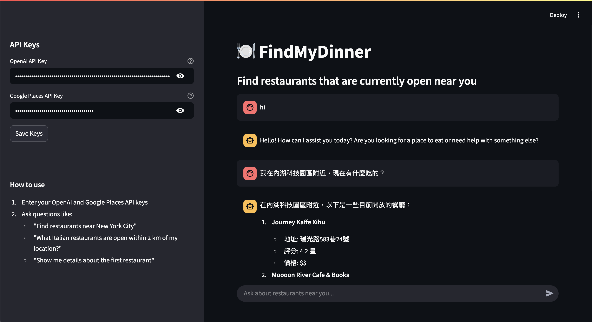

# LangChain-FindMyDinner

A Streamlit web application that uses LangChain and the Google Places API to help users find restaurants that are currently open within a specified distance from their location.

## Features

- Find restaurants that are currently open near a specified location
- Filter results by distance, cuisine type, and other criteria
- Get detailed information about specific restaurants
- User-friendly chat interface powered by LangChain

## Demo



## Project Structure

```
LangChain-FindMyDinner/
├── README.md                # Project documentation
├── .env.example             # Template for environment variables
├── requirements.txt         # Project dependencies
├── app.py                   # Main Streamlit application
├── agent/                   # LangChain agent implementation
│   ├── __init__.py
│   ├── agent.py             # Agent definition
│   └── tools.py             # Custom LangChain tools
├── services/                # External service integrations
│   ├── __init__.py
│   └── places_api.py        # Google Places API wrapper
└── utils/                   # Utility functions
    ├── __init__.py
    └── helpers.py           # Helper functions
```

## Setup Instructions

### Prerequisites

- OpenAI API key
- Google Places API key

### Option 1: Using Docker (Recommended)

1. Clone the repository:
   ```
   git clone https://github.com/tses89214/LangChain-FindMyDinner.git
   cd LangChain-FindMyDinner
   ```

2. Create a `.env` file based on the `.env.example` template:
   ```
   cp .env.example .env
   ```

3. Edit the `.env` file and add your API keys:
   ```
   OPENAI_API_KEY=your_openai_api_key_here
   GOOGLE_PLACES_API_KEY=your_google_places_api_key_here
   ```

4. Build and run the Docker container:
   ```
   docker-compose up
   ```

5. Open your web browser and go to http://localhost:8501

### Option 2: Local Installation

1. Clone the repository:
   ```
   git clone https://github.com/tses89214/LangChain-FindMyDinner.git
   cd LangChain-FindMyDinner
   ```

2. Create a virtual environment and activate it:
   ```
   python -m venv venv
   source venv/bin/activate  # On Windows: venv\Scripts\activate
   ```

3. Install the required packages:
   ```
   pip install -r requirements.txt
   ```

4. Create a `.env` file based on the `.env.example` template:
   ```
   cp .env.example .env
   ```

5. Edit the `.env` file and add your API keys:
   ```
   OPENAI_API_KEY=your_openai_api_key_here
   GOOGLE_PLACES_API_KEY=your_google_places_api_key_here
   ```

### Getting API Keys

#### OpenAI API Key
1. Go to [OpenAI's website](https://platform.openai.com/)
2. Sign up or log in
3. Navigate to the API section
4. Create a new API key

#### Google Places API Key
1. Go to the [Google Cloud Console](https://console.cloud.google.com/)
2. Create a new project or select an existing one
3. Enable the Places API
4. Create an API key in the Credentials section

## Usage

### Running with Docker

If you're using Docker, the application will be available at http://localhost:8501 after running `docker-compose up`.

### Running Locally

1. Run the Streamlit application:
   ```
   streamlit run app.py
   ```

2. Open your web browser and go to http://localhost:8501

3. If you haven't set the API keys in the `.env` file, enter them in the sidebar

4. Start chatting with the agent by asking questions like:
   - "Find restaurants near New York City"
   - "What Italian restaurants are open within 2 km of my location?"
   - "Show me details about the first restaurant"

## How It Works

1. The user enters a query in the chat interface
2. The LangChain agent processes the query and determines which tool to use
3. The agent uses the appropriate tool to interact with the Google Places API
4. The results are formatted and displayed to the user

## Contributing

Contributions are welcome! Please feel free to submit a Pull Request.

## License

This project is licensed under the MIT License - see the LICENSE file for details.
